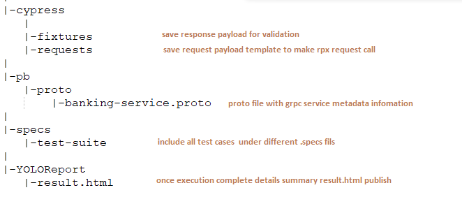
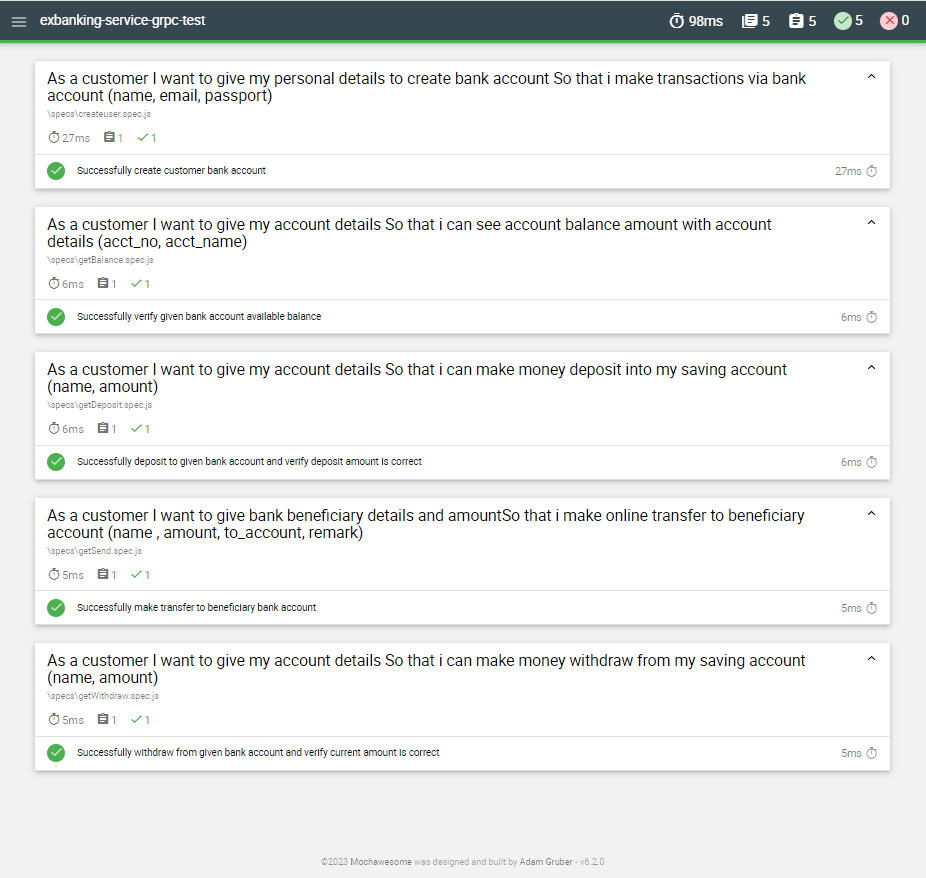

# exbanking-service-grpc-test
*exbanking-service-grpc-test* automated suite will maintain Exbanking service grpc functional test cases. This gRPC functional test automation project is a combination of JavaScript programming language and Cypress.io In addition, to enable a grpc mock  client, a customized solution with @grpc/proto-loader and @grpc/grpc-js npm lib are being used in this async test automation platform.

## Step 01 : Clone gRPC Automated Functional Test Project
Clone [exbanking-service-grpc-test](https://github.com/shiwanthaL/exbanking-service-grpc-test) github project in your running machine
```bash
$ git clone https://github.com/shiwanthaL/exbanking-service-grpc-test.git
```
### Project structure 
Understand gRPC functional service test project major folder hierarchy 

## Step 02 : gRPC Server Setup and Installation
As a Prerequisite to execute functional testcases, please follow below instructions to get up and running Exbank gRPC endpoint,

1. Open separate bach (cmd) window on project root directory

2. Get up and running gRPC service endpoints using below command (***Don't close terminal until testcases execution complete***)
```bash
$ java -jar exbanking-service-protobuf-endpoints.jar
```


## Step 03 : Execute Exbank service level functional testcases

Make sure installed NodeJS already setup in running machine
```bash
$ node -v
```
Open new bash terminal and go to **exbanking-service-grpc-test root directory** using separate bash and execute below commands
```bash
$ npm install
```
Execute Exbanking service level smoke test suite
```bash
$ npm run test
```


## Step 04 : Analysis Execution Result
Execution result will gererate under root directory folder called "YOLOReport"
Open result.html file in browser



NPM Used major libraries

[@grpc/grpc-js](https://www.npmjs.com/package/@grpc/grpc-js)  |  [@grpc/proto-loader](https://www.npmjs.com/package/@grpc/proto-loader)  |  [node-grpc-client](https://www.npmjs.com/package/node-grpc-client)  |  [cypress-protobuf](https://www.npmjs.com/package/cypress-protobuf)  |  [mocha](https://www.npmjs.com/package/mocha)


## License
[MIT](https://choosealicense.com/licenses/mit/)
