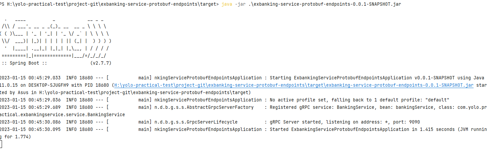
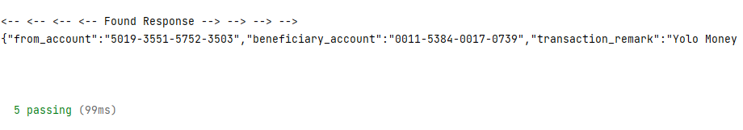

# exbanking-service-grpc-test
exbanking-service-perf-test automated suite will maintain Exbanking service grpc functional test cases. This gRPC functional test automation project is a combination of JavaScript programming language and Cypress.io In addition, to enable a grpc mock  client, a customized solution with @grpc/proto-loader and @grpc/grpc-js npm lib are being used in this async test automation platform.

## Step 01 : Clone gRPC Automated Functional Test Project
Clone [exbanking-service-grpc-test](https://github.com/shiwanthaL/exbanking-service-grpc-test) github project in your running machine
```bash
$ git clone https://github.com/shiwanthaL/exbanking-service-grpc-test.git
```

## Step 02 : gRPC Server Setup and Installation
As a Prerequisite to execute functional testcases, please follow below instructions to get up and running Exbank gRPC endpoint,

1. Open separate bach (cmd) window on project root directory

2. Get up and running gRPC service endpoints using below command
```bash
$ java -jar exbanking-service-protobuf-endpoints.jar
```


## Step 03 : Execute Exbank service level functional testcases

Use the package manager [npm](https://www.npmjs.com/) to install this project and make sure installed NodeJS setup in running machine
```bash
$ node -v
```
Go to exbanking-service-grpc-test root directory using separate bash and execute below commands

Execute Exbanking service level smoke test suite
```bash
$ npm run test
```



## License
[MIT](https://choosealicense.com/licenses/mit/)
